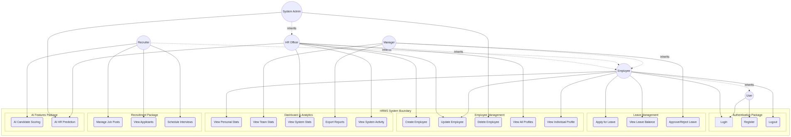

# Chapter 3: System Model

## 3.1 Use Case Diagram

The HRMS use case diagram (Figure 3.1) models interactions between six system actors and core functionalities grouped into logical packages, including a forward-looking AI Features module to support data-driven HR decisions. The diagram employs generalization relationships (--|>) to establish role inheritance, ensuring privilege escalation while minimizing redundancy and maintaining clarity.

### 3.1.1 System Actors

| Actor | Description |
|-------|-------------|
| **User (Unauthenticated)** | A visitor who has not logged in. Can only access authentication functions. |
| **Employee** | Base role for all staff (academic or administrative). Has self-service capabilities for personal HR tasks. |
| **Manager** | Supervisory role (e.g., Department Head). Inherits Employee privileges and gains team oversight functions. |
| **Recruiter** | HR staff specialized in hiring. Inherits Employee privileges and adds recruitment-specific actions and AI tools. |
| **HR Officer** | Core HR administrator. Inherits Employee privileges and manages enterprise-wide data, reporting, and analytics. |
| **System Admin** | Superuser with full system control, including irreversible operations like account deletion. |

### 3.1.2 Use Case Packages

| Package | Use Cases |
|---------|-----------|
| **Authentication** | Login, Logout, Register (Self/Admin) |
| **Dashboard & Analytics** | View Personal Stats, View Team Stats, View Recruitment Stats, Update System Stats, Export Reports (CSV), View System Activity |
| **Employee Management** | View All Employees, View Employee Profile, Create Employee, Update Employee, Delete Employee |
| **Leave Management** | Apply for Leave, View Leave Balance, Approve/Reject Leave |
| **Recruitment** | Manage Job Posts, View Applicants, Schedule Interviews, Expedite Interviews |
| **AI Features** | AI Candidate Scoring, AI HR Prediction Insights |

### 3.1.3 Actor-Use Case Matrix

| Use Case | User | Employee | Manager | Recruiter | HR Officer | System Admin |
|----------|:----:|:--------:|:-------:|:---------:|:----------:|:------------:|
| Login | ✓ | ✓ | ✓ | ✓ | ✓ | ✓ |
| Logout | - | ✓ | ✓ | ✓ | ✓ | ✓ |
| Register (Self/Admin) | ✓ | - | - | - | ✓ | ✓ |
| View Personal Stats | - | ✓ | ✓ | ✓ | ✓ | ✓ |
| View Team Stats | - | - | ✓ | - | ✓ | ✓ |
| View Recruitment Stats | - | - | - | ✓ | ✓ | ✓ |
| Update System Stats | - | - | - | - | ✓ | ✓ |
| Export Reports (CSV) | - | - | ✓ | ✓ | ✓ | ✓ |
| View System Activity | - | - | - | - | ✓ | ✓ |
| View All Employees | - | - | - | - | ✓ | ✓ |
| View Employee Profile | - | ✓ | ✓ | ✓ | ✓ | ✓ |
| Create Employee | - | - | - | - | ✓ | ✓ |
| Update Employee | - | ✓* | ✓* | - | ✓ | ✓ |
| Delete Employee | - | - | - | - | - | ✓ |
| Apply for Leave | - | ✓ | ✓ | ✓ | ✓ | ✓ |
| View Leave Balance | - | ✓ | ✓ | ✓ | ✓ | ✓ |
| Approve/Reject Leave | - | - | ✓ | - | ✓ | ✓ |
| Manage Job Posts | - | - | - | ✓ | ✓ | ✓ |
| View Applicants | - | - | - | ✓ | ✓ | ✓ |
| Schedule Interviews | - | - | - | ✓ | ✓ | ✓ |
| Expedite Interviews | - | - | - | ✓ | ✓ | ✓ |
| AI Candidate Scoring | - | - | - | ✓ | - | - |
| AI HR Prediction Insights | - | - | - | - | ✓ | ✓ |

> **Note:** ✓* indicates limited access (e.g., Employee can only update own profile)

---

## 3.2 Use Case Descriptions

### Table 3.1: Use Case Description for Login

| Field | Description |
|-------|-------------|
| **Use Case ID** | UC01 |
| **Use Case Name** | Login |
| **Actor** | User (Unauthenticated), Employee, Manager, Recruiter, HR Officer, System Admin |
| **Description** | Authenticate user credentials to grant role-based system access. |
| **Precondition** | User must have a registered account with valid email and password. |
| **Post Condition** | User is redirected to their role-specific dashboard. |
| **Flow of Action** | 1. User navigates to `/login` page 2. User enters email address 3. User enters password 4. User clicks "Login" 5. System validates credentials 6. System generates JWT token 7. System redirects user to dashboard |
| **Alternative Flow** | **A1: Invalid Credentials** 5a. System displays error 5b. System reloads form |

---

### Table 3.2: Use Case Description for Logout

| Field | Description |
|-------|-------------|
| **Use Case ID** | UC02 |
| **Use Case Name** | Logout |
| **Actor** | All Authenticated Actors |
| **Description** | Terminate the current authenticated session. |
| **Precondition** | User is logged in. |
| **Post Condition** | Session is terminated; user redirected to login. |
| **Flow of Action** | 1. User clicks "Logout" 2. System clears session/token 3. System redirects to login page |
| **Alternative Flow** | None |

---

### Table 3.3: Use Case Description for Register (Self/Admin)

| Field | Description |
|-------|-------------|
| **Use Case ID** | UC03 |
| **Use Case Name** | Register (Self/Admin) |
| **Actor** | User (Self), HR Officer/Admin (Admin) |
| **Description** | Create a new user account via self-service or admin panel. |
| **Precondition** | Valid email (Self) or Admin Rights (Admin). |
| **Post Condition** | Account created (Pending/Active). |
| **Flow of Action** | 1. User/Admin fills registration details 2. Submits form 3. System validates input 4. Account created |
| **Alternative Flow** | **A1: Email Exists** 3a. System shows error |

---

### Table 3.4: Use Case Description for View Personal Stats

| Field | Description |
|-------|-------------|
| **Use Case ID** | UC04 |
| **Use Case Name** | View Personal Stats |
| **Actor** | All Authenticated Actors |
| **Description** | View personal dashboard statistics (leave, tasks, etc.). |
| **Precondition** | User is logged in. |
| **Post Condition** | Stats displayed. |
| **Flow of Action** | 1. User accesses Dashboard 2. System fetches personal data 3. Displays widgets |
| **Alternative Flow** | None |

---

### Table 3.5: Use Case Description for View Team Stats

| Field | Description |
|-------|-------------|
| **Use Case ID** | UC05 |
| **Use Case Name** | View Team Stats |
| **Actor** | Manager, HR Officer, System Admin |
| **Description** | View aggregate statistics for led teams. |
| **Precondition** | User has team members. |
| **Post Condition** | Team stats displayed. |
| **Flow of Action** | 1. User navigates to Team Dashboard 2. System calculates aggregates 3. Displays charts/tables |
| **Alternative Flow** | **A1: No Team** 2a. System shows empty state |

---

### Table 3.6: Use Case Description for View Recruitment Stats

| Field | Description |
|-------|-------------|
| **Use Case ID** | UC06 |
| **Use Case Name** | View Recruitment Stats |
| **Actor** | Recruiter, HR Officer, System Admin |
| **Description** | View statistics related to hiring pipeline and job postings. |
| **Precondition** | User has recruitment access. |
| **Post Condition** | Recruitment metrics displayed. |
| **Flow of Action** | 1. User accesses Recruitment Dashboard 2. System fetches hiring data 3. Displays pipeline stages and counts |
| **Alternative Flow** | None |

---

### Table 3.7: Use Case Description for Export Reports (CSV)

| Field | Description |
|-------|-------------|
| **Use Case ID** | UC07 |
| **Use Case Name** | Export Reports (CSV) |
| **Actor** | Manager, Recruiter, HR Officer, System Admin |
| **Description** | Download system data as CSV reports. |
| **Precondition** | Data available to export. |
| **Post Condition** | CSV file downloaded. |
| **Flow of Action** | 1. User selects report type 2. Sets filters 3. Clicks Export 4. System generates CSV 5. Download starts |
| **Alternative Flow** | None |

---

### Table 3.8: Use Case Description for View System Activity

| Field | Description |
|-------|-------------|
| **Use Case ID** | UC08 |
| **Use Case Name** | View System Activity |
| **Actor** | HR Officer, System Admin |
| **Description** | View audit logs of system actions. |
| **Precondition** | Admin privileges. |
| **Post Condition** | Activity log displayed. |
| **Flow of Action** | 1. User navigates to Activity Log 2. System fetches logs 3. Displays list sorted by time |
| **Alternative Flow** | None |

---

### Table 3.9: Use Case Description for View All Employees

| Field | Description |
|-------|-------------|
| **Use Case ID** | UC09 |
| **Use Case Name** | View All Employees |
| **Actor** | HR Officer, System Admin |
| **Description** | View list of all registered employees. |
| **Precondition** | Admin privileges. |
| **Post Condition** | Directory displayed. |
| **Flow of Action** | 1. User navigates to Employee Directory 2. System fetches all records 3. Displays list with actions |
| **Alternative Flow** | None |

---

### Table 3.10: Use Case Description for Create Employee

| Field | Description |
|-------|-------------|
| **Use Case ID** | UC10 |
| **Use Case Name** | Create Employee |
| **Actor** | HR Officer, System Admin |
| **Description** | Add a new employee record to the system. |
| **Precondition** | Admin privileges. |
| **Post Condition** | Employee created. |
| **Flow of Action** | 1. User opens "Add Employee" form 2. Fills details 3. Submits 4. System saves record |
| **Alternative Flow** | **A1: Validation Error** 3a. System shows error |

---

### Table 3.11: Use Case Description for Delete Employee

| Field | Description |
|-------|-------------|
| **Use Case ID** | UC11 |
| **Use Case Name** | Delete Employee |
| **Actor** | System Admin |
| **Description** | Permanently remove or archive employee. |
| **Precondition** | Admin privileges, Employee exists. |
| **Post Condition** | Employee removed/archived. |
| **Flow of Action** | 1. User selects employee 2. Clicks Delete 3. Confirms action 4. System processes deletion |
| **Alternative Flow** | None |

---

### Table 3.12: Use Case Description for View Employee Profile

| Field | Description |
|-------|-------------|
| **Use Case ID** | UC12 |
| **Use Case Name** | View Employee Profile |
| **Actor** | All Authenticated Actors |
| **Description** | View details of a specific employee. |
| **Precondition** | Permission to view target profile. |
| **Post Condition** | Profile details displayed. |
| **Flow of Action** | 1. User clicks on employee name/link 2. System checks permissions 3. Displays profile page |
| **Alternative Flow** | **A1: Access Denied** 2a. System restricts view |

---

### Table 3.13: Use Case Description for Update System Stats

| Field | Description |
|-------|-------------|
| **Use Case ID** | UC13 |
| **Use Case Name** | Update System Stats |
| **Actor** | HR Officer, System Admin |
| **Description** | Refresh or manually update system-wide statistics. |
| **Precondition** | Admin privileges. |
| **Post Condition** | Statistics updated. |
| **Flow of Action** | 1. User navigates to Stats Settings 2. Triggers update/refresh 3. System recalculates metrics 4. Dashboard updated |
| **Alternative Flow** | None |

---

### Table 3.14: Use Case Description for View Leave Balance

| Field | Description |
|-------|-------------|
| **Use Case ID** | UC14 |
| **Use Case Name** | View Leave Balance |
| **Actor** | All Authenticated Actors |
| **Description** | View remaining leave quotas. |
| **Precondition** | Logged in. |
| **Post Condition** | Balance displayed. |
| **Flow of Action** | 1. User navigates to Leave section 2. System fetches balances 3. Displays allocation vs used |
| **Alternative Flow** | None |

---

### Table 3.15: Use Case Description for Approve/Reject Leave

| Field | Description |
|-------|-------------|
| **Use Case ID** | UC15 |
| **Use Case Name** | Approve/Reject Leave |
| **Actor** | Manager, HR Officer, System Admin |
| **Description** | Process leave requests. |
| **Precondition** | Pending requests exist. |
| **Post Condition** | Request status updated. |
| **Flow of Action** | 1. Use views pending requests 2. Selects action (Approve/Reject) 3. Submits 4. System updates status & notifies |
| **Alternative Flow** | None |

---

### Table 3.16: Use Case Description for Apply for Leave

| Field | Description |
|-------|-------------|
| **Use Case ID** | UC16 |
| **Use Case Name** | Apply for Leave |
| **Actor** | All Authenticated Actors |
| **Description** | Submit a leave request. |
| **Precondition** | Sufficient balance. |
| **Post Condition** | Request submitted. |
| **Flow of Action** | 1. User opens Apply form 2. Selects type and dates 3. Submits 4. System validates and saves |
| **Alternative Flow** | **A1: Insufficient Balance** 3a. System rejects submission |

---

### Table 3.17: Use Case Description for Manage Job Posts

| Field | Description |
|-------|-------------|
| **Use Case ID** | UC17 |
| **Use Case Name** | Manage Job Posts |
| **Actor** | Recruiter, HR Officer, System Admin |
| **Description** | Create, update, or remove job listings. |
| **Precondition** | Recruitment privileges. |
| **Post Condition** | Job post managed. |
| **Flow of Action** | 1. User navigates to Jobs 2. Selects Add or Edit 3. Modifies details 4. Saves |
| **Alternative Flow** | None |

---

### Table 3.18: Use Case Description for View Applicants

| Field | Description |
|-------|-------------|
| **Use Case ID** | UC18 |
| **Use Case Name** | View Applicants |
| **Actor** | Recruiter, HR Officer, System Admin |
| **Description** | View candidates applied to jobs. |
| **Precondition** | Applicants exist. |
| **Post Condition** | List displayed. |
| **Flow of Action** | 1. User selects Job Post 2. System lists applicants 3. User views candidate details |
| **Alternative Flow** | None |

---

### Table 3.19: Use Case Description for Schedule Interviews

| Field | Description |
|-------|-------------|
| **Use Case ID** | UC19 |
| **Use Case Name** | Schedule Interviews |
| **Actor** | Recruiter, HR Officer, System Admin |
| **Description** | Arrange interview times with candidates. |
| **Precondition** | Candidate in screening. |
| **Post Condition** | Interview scheduled. |
| **Flow of Action** | 1. User selects candidate 2. Clicks Schedule 3. Sets date/time/panel 4. System sends invites |
| **Alternative Flow** | None |

---

### Table 3.20: Use Case Description for Expedite Interviews

| Field | Description |
|-------|-------------|
| **Use Case ID** | UC20 |
| **Use Case Name** | Expedite Interviews |
| **Actor** | Recruiter, HR Officer, System Admin |
| **Description** | Fast-track interview process for high-priority candidates. |
| **Precondition** | Urgent hiring need. |
| **Post Condition** | Interview priority raised. |
| **Flow of Action** | 1. User marks interview as Urgent 2. System flags candidate 3. Notifications sent to panel for immediate action |
| **Alternative Flow** | None |

---

### Table 3.21: Use Case Description for AI Candidate Scoring

| Field | Description |
|-------|-------------|
| **Use Case ID** | UC21 |
| **Use Case Name** | AI Candidate Scoring |
| **Actor** | Recruiter |
| **Description** | AI-driven ranking of candidates. |
| **Precondition** | CVs uploaded. |
| **Post Condition** | Candidates matched/scored. |
| **Flow of Action** | 1. Recruiter runs AI Scoring 2. System processes CVs vs Job Desc 3. Returns score/ranking |
| **Alternative Flow** | None |

---

### Table 3.22: Use Case Description for AI HR Prediction Insights

| Field | Description |
|-------|-------------|
| **Use Case ID** | UC22 |
| **Use Case Name** | AI HR Prediction Insights |
| **Actor** | HR Officer, System Admin |
| **Description** | AI analysis for turnover, staffing, and trends. |
| **Precondition** | Historical data available. |
| **Post Condition** | Insights generated. |
| **Flow of Action** | 1. User accesses AI Insights 2. Selects prediction model 3. System generates report/graph |
| **Alternative Flow** | None |

---

## 3.3 Use Case Diagram Notation

```mermaid
graph TB
    subgraph "HRMS System Boundary"
        subgraph "Authentication"
            UC01(Login)
            UC02(Logout)
            UC03(Register - Self/Admin)
        end
        
        subgraph "Dashboard & Analytics"
            UC04(View Personal Stats)
            UC05(View Team Stats)
            UC06(View Recruitment Stats)
            UC07(Export Reports - CSV)
            UC08(View System Activity)
            UC13(Update System Stats)
        end
        
        subgraph "Employee Management"
            UC09(View All Employees)
            UC12(View Employee Profile)
            UC10(Create Employee)
            UC11(Delete Employee)
            UC23(Update Employee)
        end
        
        subgraph "Leave Management"
            UC14(View Leave Balance)
            UC15(Approve/Reject Leave)
            UC16(Apply for Leave)
        end
        
        subgraph "Recruitment"
            UC17(Manage Job Posts)
            UC18(View Applicants)
            UC19(Schedule Interviews)
            UC20(Expedite Interviews)
        end
        
        subgraph "AI Features"
            UC21(AI Candidate Scoring)
            UC22(AI HR Prediction Insights)
        end
    end
    
    User((User)) --> UC01
    User --> UC03
    User --> UC02
    
    Employee((Employee)) --> UC01
    Employee --> UC02
    Employee --> UC04
    Employee --> UC12
    Employee --> UC14
    Employee --> UC16
    Employee --> UC23
    
    Manager((Manager)) --> UC05
    Manager --> UC07
    Manager --> UC15
    
    Recruiter((Recruiter)) --> UC06
    Recruiter --> UC07
    Recruiter --> UC17
    Recruiter --> UC18
    Recruiter --> UC19
    Recruiter --> UC20
    Recruiter --> UC21
    
    HROfficer((HR Officer)) --> UC03
    HROfficer --> UC08
    HROfficer --> UC09
    HROfficer --> UC10
    HROfficer --> UC13
    HROfficer --> UC22
    HROfficer --> UC23
    
    Admin((System Admin)) --> UC11
    Admin --> UC22
    
    Employee -.->|inherits| User
    Manager -.->|inherits| Employee
    Recruiter -.->|inherits| Employee
    HROfficer -.->|inherits| Employee
    Admin -.->|inherits| HROfficer
```

---

## References

- Jacobson, I., et al. (1999). *The Unified Software Development Process*. Addison-Wesley.
- Larman, C. (2004). *Applying UML and Patterns*. Prentice Hall.
- OMG (2017). *Unified Modeling Language Specification Version 2.5.1*. Object Management Group.
